# onimai_mcsm

<h1>MCSManager Onimai 10 Panel</h1>

 
<h1>Introduction</h1>

Last updated: March 7, 2026

 

[English](README.md) - [简体中文](README_ZH.md) - [繁體中文](README_TW.md) - [日本語](README_JP.md)

 

Yes, this is an open-source third-party MCSM theme for anime and manga.

This is a third-party theme developed by the author zakoxun (formerly skymc), not an official theme.

You can use it for derivative works, but please do not use it in conjunction with my project.

 
<h1>Update Log</h1>
 

• Supports MCSM 9/10. For versions below MCSM 10 (v9.9.0), simply extract the [MCSM9 Old Version](oldversions/onimai-mcsm9-oldbuild-oldversion.zip) file from the oldversions folder.

 
<h1>↓Preview Images↓</h1>

Note: If you are overseas, you can use AI translation tools like chatgpt to translate the images for your convenience!
 

<h1>Login (Mahiro Oyama)</h1>

 
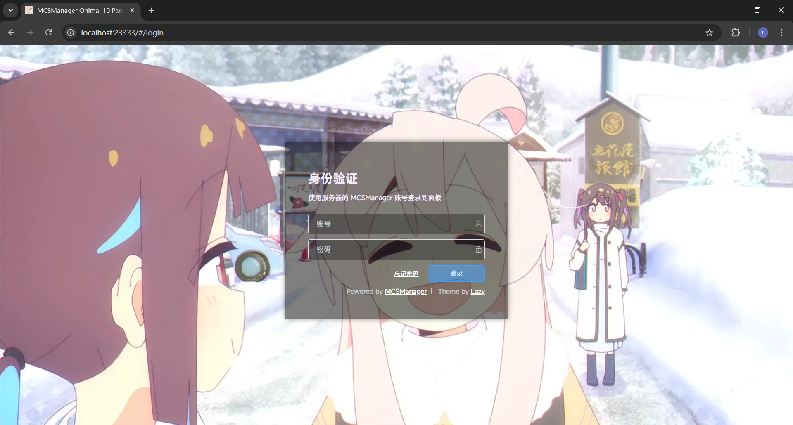

 
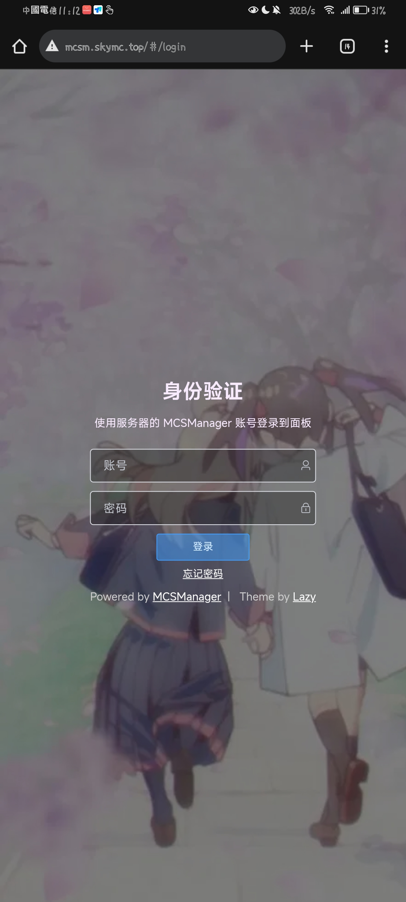

 
<h1>Home (Mahiro Oyama)</h1>

 
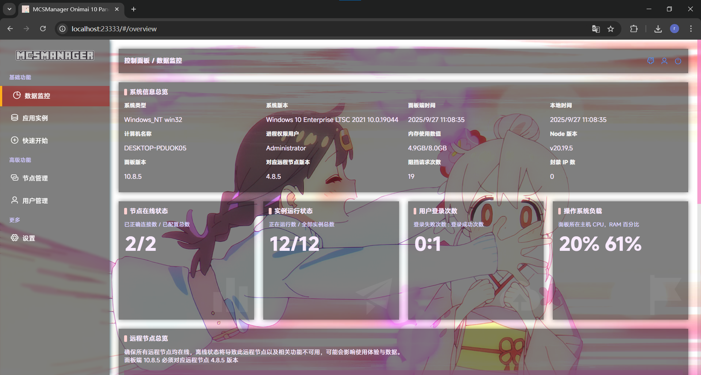

 
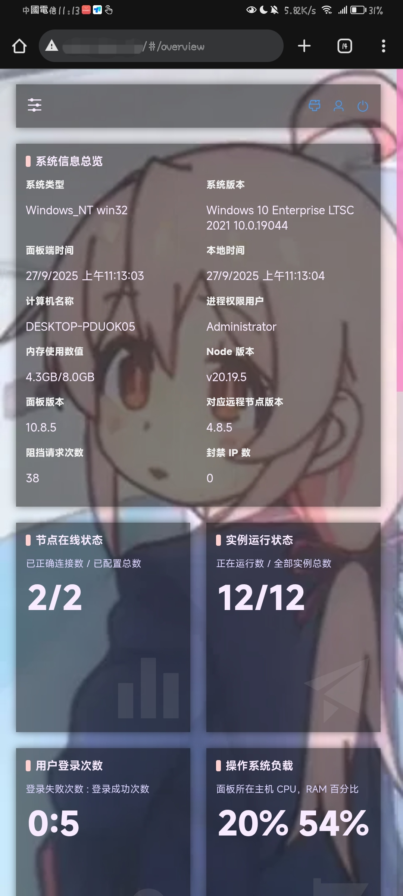

 
<h1>Terminal (Mahiro Oyama)</h1>

 
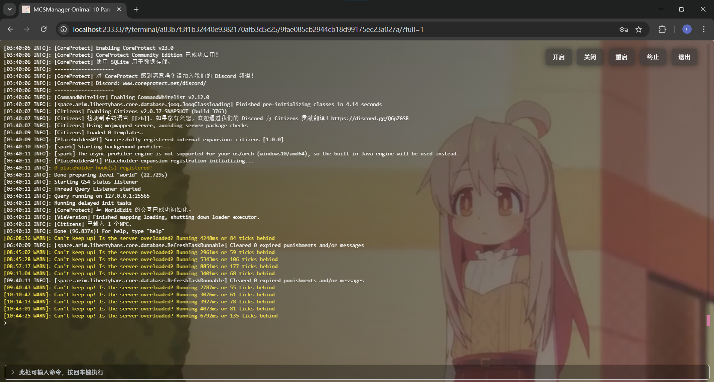

 
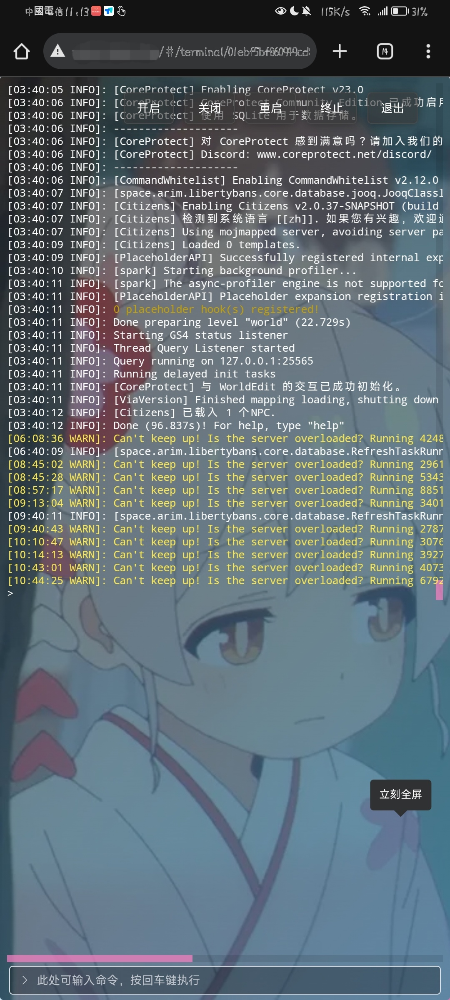

 
<h1>Login (Mihali Oyama)</h1>

 
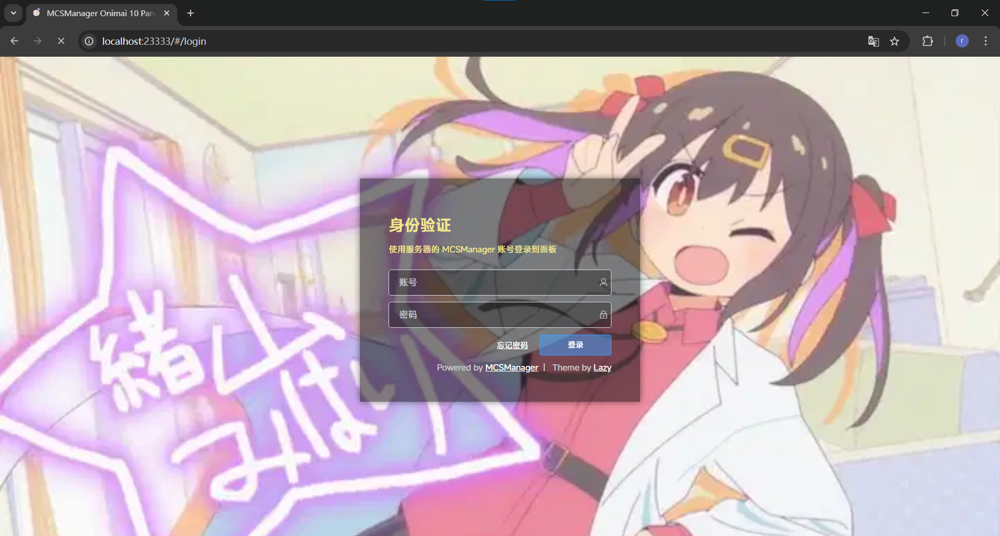

 
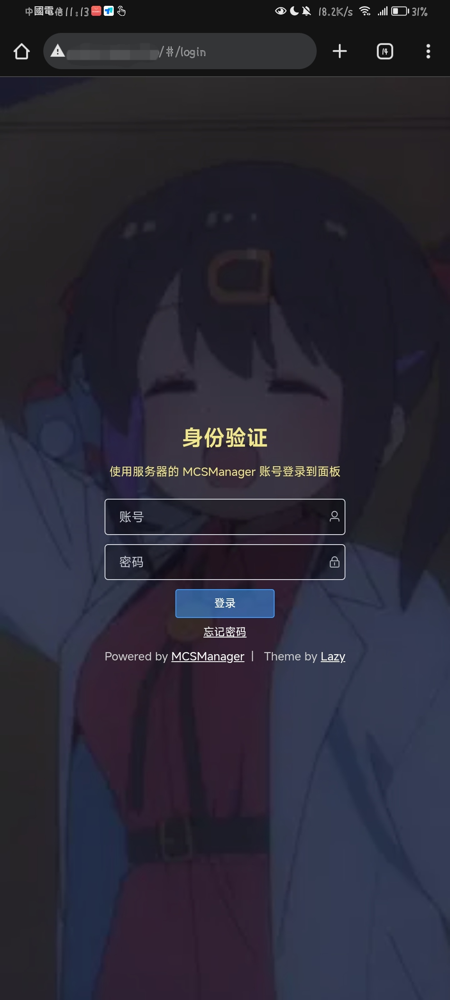

 
<h1>Home (Mihali Oyama)</h1>

 
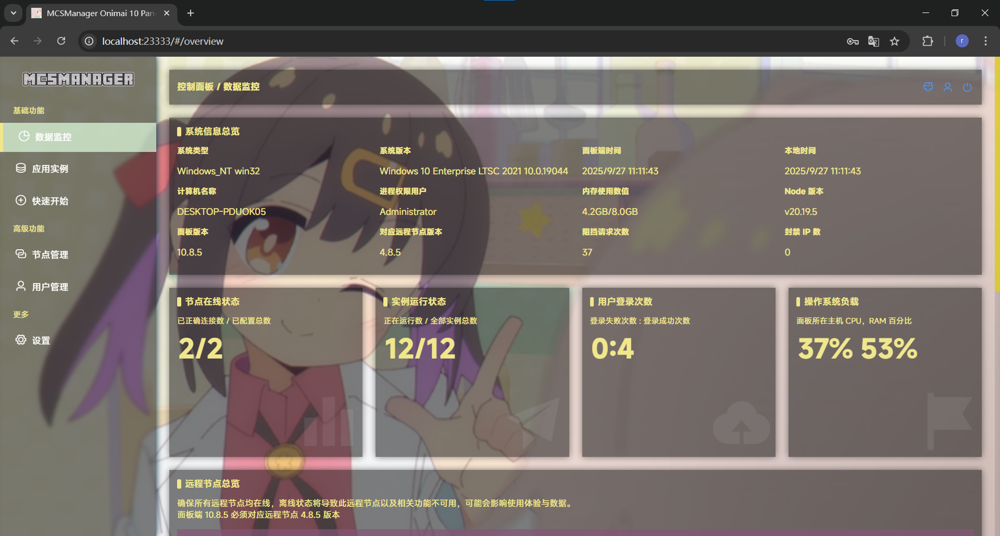

 
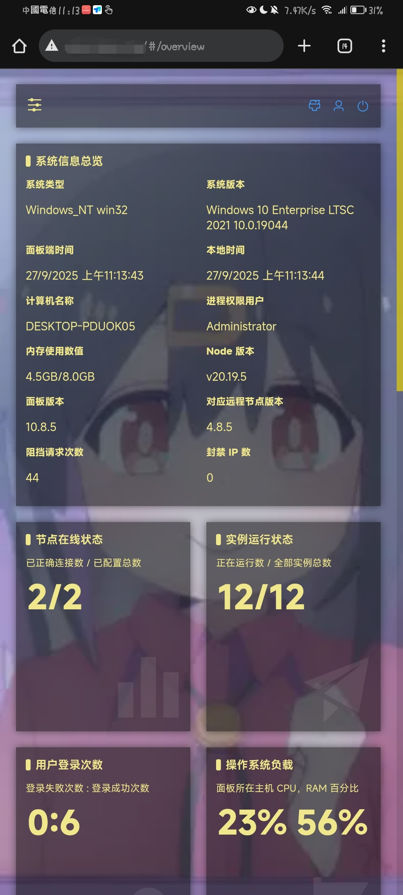

 
<h1>Terminal (Mihaori Oyama)</h1>

 
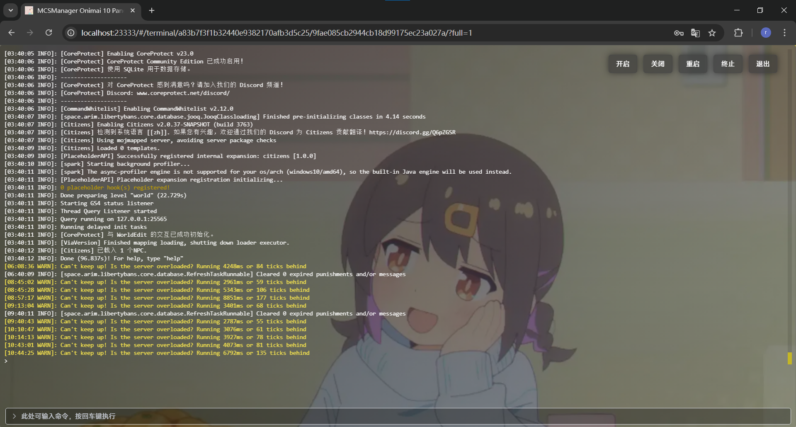

 
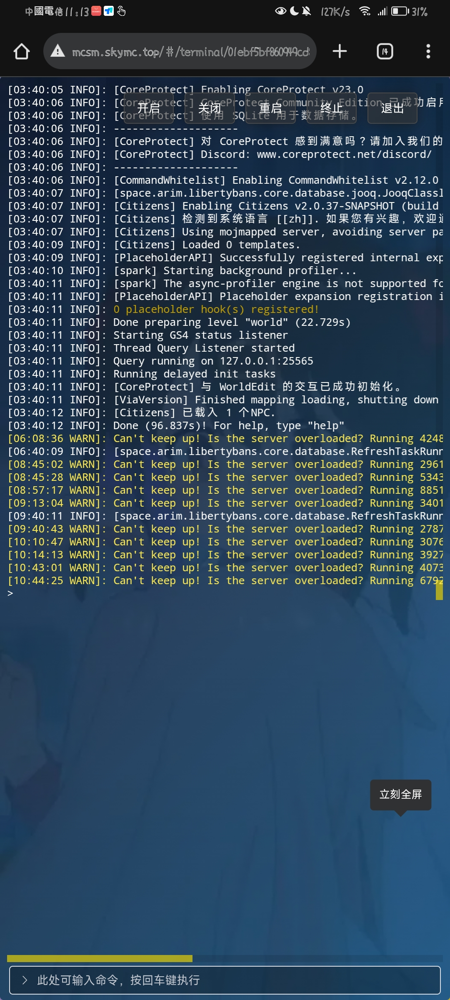

 
<h1>Disclaimer (Open Source Permission)</h1>

This theme was developed with permission from Lazy, please support the original!
